# Norse Whiteboard: architecture, data flow and live updates

This is the reference for how the app is built, where every piece of data lives, and exactly what happens when a user does something. Every diagram is written in Mermaid, so GitHub shows them as pictures. In VS Code, install the extension "Markdown Preview Mermaid Support" and press `Ctrl+Shift+V`.

Contents
1. System architecture
2. Where each kind of data lives
3. Data model (ER diagram) and the database rules
4. The live update map (every feature, how it updates, what triggers it)
5. Feature flows (sequence diagrams)
6. Frontend structure (class diagram)
7. State machines
8. Security model
9. Edge Function contracts
10. Running, deploying and changing it
11. Credentials, tokens and personal information
12. What is live, what is not, and how syncing works

---

## 1. System architecture

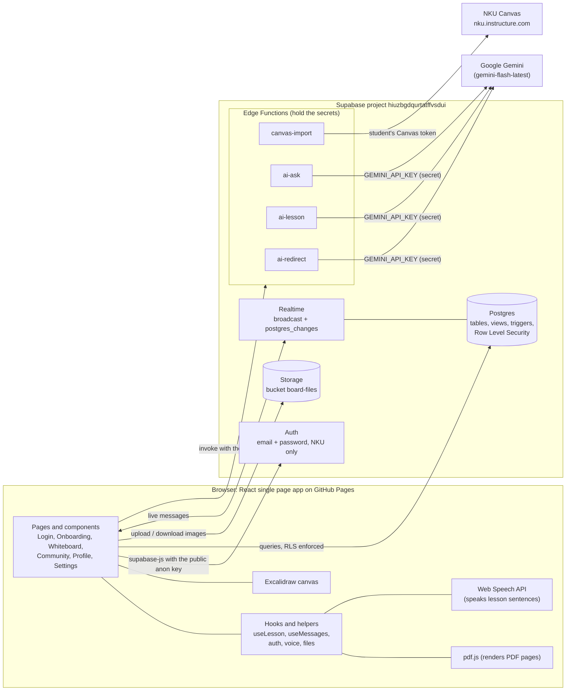
```mermaid
flowchart LR
  subgraph Browser["Browser: React single page app on GitHub Pages"]
    UI["Pages and components<br/>Login, Onboarding, Whiteboard,<br/>Community, Profile, Settings"]
    HOOKS["Hooks and helpers<br/>useLesson, useMessages,<br/>auth, voice, files"]
    EXC["Excalidraw canvas"]
    PDF["pdf.js (renders PDF pages)"]
    TTS["Web Speech API<br/>(speaks lesson sentences)"]
    UI --- HOOKS
    UI --- EXC
    HOOKS --- PDF
    HOOKS --- TTS
  end

  subgraph Supabase["Supabase project hiuzbgdqurtatffvsdui"]
    AUTH["Auth<br/>email + password, NKU only"]
    PG[("Postgres<br/>tables, views, triggers,<br/>Row Level Security")]
    STO[("Storage<br/>bucket board-files")]
    RT["Realtime<br/>broadcast + postgres_changes"]
    subgraph FN["Edge Functions (hold the secrets)"]
      F1["canvas-import"]
      F2["ai-ask"]
      F3["ai-lesson"]
      F4["ai-redirect"]
    end
  end

  GEM["Google Gemini<br/>(gemini-flash-latest)"]
  CAN["NKU Canvas<br/>nku.instructure.com"]

  UI -- "supabase-js with the public anon key" --> AUTH
  UI -- "queries, RLS enforced" --> PG
  UI -- "upload / download images" --> STO
  UI <-- "live messages" --> RT
  UI -- "invoke with the user's login" --> FN
  RT --- PG
  F1 -- "student's Canvas token" --> CAN
  F2 & F3 & F4 -- "GEMINI_API_KEY (secret)" --> GEM
```

Rules that shape everything:

- The browser only ever holds the **public anon key**. It can read and write only what Row Level Security (RLS) allows.
- The **Gemini key** and the **Canvas address** live only in Edge Function secrets. The student's Canvas token is used for two requests and then thrown away; it is never stored or logged.
- The app is a static site (GitHub Pages). There is no server of ours: Supabase is the whole backend.
- Routes use `HashRouter`, so addresses look like `/#/community`. This avoids 404 errors on refresh.

| Route | Page | Who can open it |
|---|---|---|
| `/#/login` | Sign in / create account / forgot password | anyone |
| `/#/reset` | Choose a new password (from the email link) | anyone with a reset session |
| `/#/onboarding` | Import classes from Canvas | signed in, no classes yet |
| `/#/` | Whiteboard (your last board) | signed in with classes |
| `/#/board/:id` | A specific board | signed in |
| `/#/saved/:id` | A saved board, read-only | signed in |
| `/#/community` | Find Your People (cork board) | signed in |
| `/#/profile`, `/#/settings` | Profile, Settings | signed in |

---

## 2. Where each kind of data lives

| Data | Where | How long | Who can see it |
|---|---|---|---|
| Login session (tokens) | Browser storage, managed by supabase-js | until sign out | that browser only |
| Account (email, password hash) | Supabase Auth (`auth.users`) | until account deleted | nobody but Auth |
| Profile (name, classes, settings) | `profiles` table | until account deleted | owner reads the whole row; others read only the `public_profiles` view |
| Board drawing (shapes, strokes) | `boards.scene` (JSON) | saved 3 seconds after a local change | anyone who can read the board |
| Board pictures (slides, images) | Storage bucket `board-files` + a row in `board_files` | permanent | anyone who can read the board |
| AI questions and answers | `questions` table | permanent | anyone who can read the board |
| Meetups and who joined | `meetups`, `meetup_rsvps` | meetup is hidden 2 hours after it starts | any signed-in user |
| Chats and messages | `conversations`, `conversation_members`, `messages` | permanent | members of that conversation only |
| Blocks and reports | `blocks`, `reports` | permanent | blocks: owner only. reports: insert only |
| Who is on a board right now | `board_presence` (heartbeat rows) | counts if seen in the last 60 seconds | anyone who can read the board |
| UI state (open menu, selected tool, drafts) | React state in the page | until the page closes | that browser only |
| Canvas token | typed into the box, sent once, cleared | seconds | nobody stores it |
| AI "high demand" retry state, rate-limit counters | Edge Function memory | one minute | server only |

---

## 3. Data model

### 3.1 Entity relationship diagram

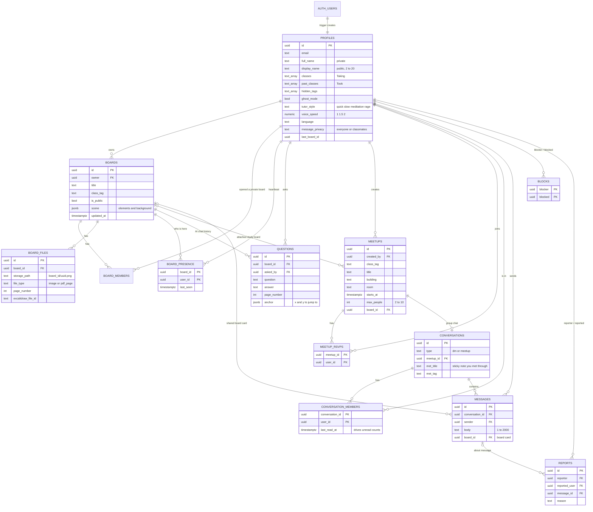
```mermaid
erDiagram
  AUTH_USERS ||--|| PROFILES : "trigger creates"
  PROFILES ||--o{ BOARDS : owns
  PROFILES ||--o{ BOARD_MEMBERS : "opened a private board"
  BOARDS ||--o{ BOARD_MEMBERS : has
  BOARDS ||--o{ BOARD_FILES : has
  BOARDS ||--o{ BOARD_PRESENCE : "who is here"
  PROFILES ||--o{ BOARD_PRESENCE : "heartbeat"
  BOARDS ||--o{ QUESTIONS : "AI chat history"
  PROFILES ||--o{ QUESTIONS : asks
  PROFILES ||--o{ MEETUPS : creates
  BOARDS |o--o{ MEETUPS : "attached study board"
  MEETUPS ||--o{ MEETUP_RSVPS : has
  PROFILES ||--o{ MEETUP_RSVPS : joins
  MEETUPS ||--o| CONVERSATIONS : "group chat"
  CONVERSATIONS ||--o{ CONVERSATION_MEMBERS : has
  PROFILES ||--o{ CONVERSATION_MEMBERS : "is in"
  CONVERSATIONS ||--o{ MESSAGES : contains
  PROFILES ||--o{ MESSAGES : sends
  BOARDS |o--o{ MESSAGES : "shared board card"
  PROFILES ||--o{ BLOCKS : "blocker / blocked"
  PROFILES ||--o{ REPORTS : "reporter / reported"
  MESSAGES |o--o{ REPORTS : "about message"

  PROFILES {
    uuid id PK
    text email
    text full_name "private"
    text display_name "public, 2 to 20"
    text_array classes "Taking"
    text_array past_classes "Took"
    text_array hidden_tags
    bool ghost_mode
    text tutor_style "quick slow meditation rage"
    numeric voice_speed "1 1.5 2"
    text language
    text message_privacy "everyone or classmates"
    uuid last_board_id
  }
  BOARDS {
    uuid id PK
    uuid owner FK
    text title
    text class_tag
    bool is_public
    jsonb scene "elements and background"
    timestamptz updated_at
  }
  BOARD_FILES {
    uuid id PK
    uuid board_id FK
    text storage_path "board_id/uuid.png"
    text file_type "image or pdf_page"
    int page_number
    text excalidraw_file_id
  }
  BOARD_PRESENCE {
    uuid board_id PK
    uuid user_id PK
    timestamptz last_seen
  }
  QUESTIONS {
    uuid id PK
    uuid board_id FK
    uuid asked_by FK
    text question
    text answer
    int page_number
    jsonb anchor "x and y to jump to"
  }
  MEETUPS {
    uuid id PK
    uuid created_by FK
    text class_tag
    text title
    text building
    text room
    timestamptz starts_at
    int max_people "2 to 10"
    uuid board_id FK
  }
  MEETUP_RSVPS {
    uuid meetup_id PK
    uuid user_id PK
  }
  CONVERSATIONS {
    uuid id PK
    text type "dm or meetup"
    uuid meetup_id FK
    text met_title "sticky note you met through"
    text met_tag
  }
  CONVERSATION_MEMBERS {
    uuid conversation_id PK
    uuid user_id PK
    timestamptz last_read_at "drives unread counts"
  }
  MESSAGES {
    uuid id PK
    uuid conversation_id FK
    uuid sender FK
    text body "1 to 2000"
    uuid board_id FK "board card"
  }
  BLOCKS {
    uuid blocker PK
    uuid blocked PK
  }
  REPORTS {
    uuid id PK
    uuid reporter FK
    uuid reported_user FK
    uuid message_id FK
    text reason
  }
```

Views: `public_profiles` (id, display_name, visible classes, visible past classes, ghost_mode, message_privacy; hidden tags are removed) and `board_live` (boards with at least one non-ghost viewer seen in the last 60 seconds).

### 3.2 Triggers and functions (the "server logic" inside Postgres)

| Name | Fires | What it does |
|---|---|---|
| `handle_new_user` | after a row is added to `auth.users` | rejects emails not ending in `@nku.edu`; creates the `profiles` row with display name like "First L." |
| `guard_board_update` | before a board is updated | only the owner may change title, class tag, visibility or owner; stamps `updated_at` |
| `check_rsvp_cap` | before a row is added to `meetup_rsvps` | locks the meetup row, counts joiners, rejects with "This meetup is full" if at the limit (stops two people taking the last spot) |
| `on_meetup_created` | after a meetup is created | creates its group chat and RSVPs the creator |
| `on_rsvp_added` | after a join | adds that person to the meetup's group chat |
| `on_rsvp_removed` | after a leave | removes that person from the group chat |
| `can_read_board(b)` | used inside RLS rules | true if the board is public, or you own it, or you are in `board_members` |
| `is_member(c)` | used inside RLS rules | true if you are in that conversation |
| `dm_blocked(c)` | used inside the send-message rule | true if a block exists in either direction in a DM |
| `open_board(b)` | called when opening `/board/:id` | records you as a member so private boards opened by link stay readable |
| `start_dm(other, note_title, note_tag)` | called from the person popup | checks blocks and `message_privacy`, then returns the existing chat or creates one and remembers the sticky note |
| `delete_my_account()` | called from Settings | deletes your `auth.users` row; everything you own cascades away |

### 3.3 Row Level Security in one table

| Table | Read | Write |
|---|---|---|
| `profiles` | own row only (others use `public_profiles`) | own row only |
| `boards` | owner, or public, or member | create as yourself; anyone who can read may update (this is how everyone can draw); owner deletes |
| `board_members` | own rows | add yourself |
| `board_files`, `questions`, `board_presence` | if you can read the board | `questions`: as yourself. `board_presence`: your own row only |
| `meetups`, `meetup_rsvps` | any signed-in user | meetups: creator edits and deletes. RSVPs: only yourself, subject to the cap |
| `conversations`, `conversation_members`, `messages` | members only | messages: as yourself, as a member, and not blocked |
| `blocks` | owner only | owner only |
| `reports` | nobody (write-only inbox) | insert as yourself |
| Storage `board-files` | if you can read the board named by the first folder of the path | same |

---

## 4. The live update map

This is the most important table for "how does X update live". There are four mechanisms:

- **Broadcast**: a message sent through a Realtime channel straight to everyone currently on that channel. Nothing is stored. Used for drawing and lesson captions.
- **Postgres changes**: Supabase watches a table and tells the browser when a row is inserted or changed. Realtime only delivers rows the user is allowed to read (RLS applies). Used for questions, meetups, joins, messages.
- **Polling**: the browser asks again every 20 seconds. Used where a row ages out (who is here, live boards).
- **Reload on action**: the page re-queries after the user does something.

Tables that are published to Realtime: `messages`, `meetups`, `meetup_rsvps`, `conversation_members`, `board_presence`, `questions`.

| Feature | What changes | Mechanism | Channel / table | What triggers the update | Speed |
|---|---|---|---|---|---|
| Drawing on a board | strokes, shapes, deletions, pictures | **Broadcast** event `scene` + **autosave** | channel `board:{id}`; saves to `boards.scene` | local change: elements whose version changed are queued and sent every 80 ms | under 1 second |
| Catching up after a gap | whole scene | reload on action | `boards.scene` | channel connects, or a hidden tab becomes visible again; merged with "higher version wins" | on event |
| Autosave | `boards.scene` | write | `boards` | 3 seconds after the last local change, and when the tab is hidden; only the person who changed things saves | 3 seconds |
| Uploaded pictures on other screens | image files | Broadcast of the image element, then download | Storage + `board_files` | an `image` element arrives whose file this browser doesn't have | 1 to 3 seconds |
| AI lesson captions and voice | current sentence, pause, end | **Broadcast** event `lesson` | channel `board:{id}` | the person running the lesson sends start, each step, pause, resume, end | immediate |
| AI lesson diagrams | shapes the AI draws | same as drawing | channel `board:{id}` | lesson draws through the normal path, so it is broadcast like any stroke | under 1 second |
| AI chat history | new question and answer | **Postgres changes** INSERT | `questions` filtered by `board_id` | someone asks | under 1 second |
| "Live · N here" and avatars | people on this board | **Heartbeat + polling** | `board_presence`, `public_profiles` | each browser writes its row every 20 s and re-reads every 20 s; counts rows seen in the last 60 s, not ghost mode | up to 20 s |
| Community: joins and leaves | counts, avatars, Full, Join/Leave | **Postgres changes** (any event) | `meetup_rsvps` | someone joins or leaves; the page reloads its lists | under 1 second |
| Community: new or removed notes | the grid | **Postgres changes** (any event) | `meetups` | create, edit, remove | under 1 second |
| Community: live boards | "N studying now" | **Polling** every 20 s | `board_live`, `board_presence` | timer | up to 20 s |
| Messages: inbox list and unread badge | last message, unread dot, bubble count | **Postgres changes** | `messages` INSERT, `conversation_members` any | any message in a chat you are in; the list is rebuilt | under 1 second |
| Messages: open chat | new bubbles | **Postgres changes** INSERT | `messages` filtered by `conversation_id` | new message; also marks the chat read | under 1 second |
| Unread counts | per chat and total | computed | `messages` vs `conversation_members.last_read_at` | messages from others newer than `last_read_at`; opening the chat sets it to now | with the inbox |
| Meetup group chat membership | who is in the chat | database triggers | `meetup_rsvps` to `conversation_members` | join adds, leave removes, create makes the chat | in the same transaction |
| Online / Ghost pill (Community) | green "Live" or red "Offline" / "Ghost mode" | browser events | `window online/offline`, `profiles.ghost_mode` | connection changes, or the Ghost switch | immediate |
| Profile and Settings changes | names, tags, voice, language | **Reload on action** | `profiles` | after each save the app re-reads your profile; every page reads the same copy | immediate on your screen; others see names and tags on their next load |
| Login state | session, redirects | auth events | Supabase Auth | sign in, sign out, token refresh, password-reset link | immediate |

What is **not** live: other people's profile changes (you see a new display name on your next load), the list of saved boards, and who has you blocked.

---

## 5. Feature flows

### 5.1 Sign up, sign in, reset password, and the route guard

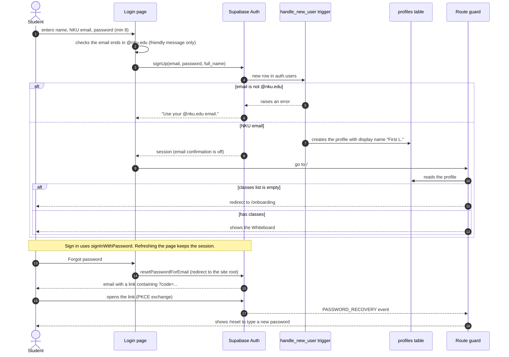
```mermaid
sequenceDiagram
  autonumber
  actor U as Student
  participant L as Login page
  participant A as Supabase Auth
  participant T as handle_new_user trigger
  participant P as profiles table
  participant G as Route guard

  U->>L: enters name, NKU email, password (min 8)
  L->>L: checks the email ends in @nku.edu (friendly message only)
  L->>A: signUp(email, password, full_name)
  A->>T: new row in auth.users
  alt email is not @nku.edu
    T-->>A: raises an error
    A-->>L: "Use your @nku.edu email."
  else NKU email
    T->>P: creates the profile with display name "First L."
    A-->>L: session (email confirmation is off)
    L->>G: go to /
    G->>P: reads the profile
    alt classes list is empty
      G-->>U: redirect to /onboarding
    else has classes
      G-->>U: shows the Whiteboard
    end
  end
  Note over U,A: Sign in uses signInWithPassword. Refreshing the page keeps the session.
  U->>L: Forgot password
  L->>A: resetPasswordForEmail (redirect to the site root)
  A-->>U: email with a link containing ?code=...
  U->>A: opens the link (PKCE exchange)
  A-->>G: PASSWORD_RECOVERY event
  G-->>U: shows /reset to type a new password
```

The NKU check exists twice on purpose: the form check is only for a friendly message; the database trigger is the real gate, so a Gmail address is rejected even if someone bypasses the form.

### 5.2 Onboarding: import classes from Canvas

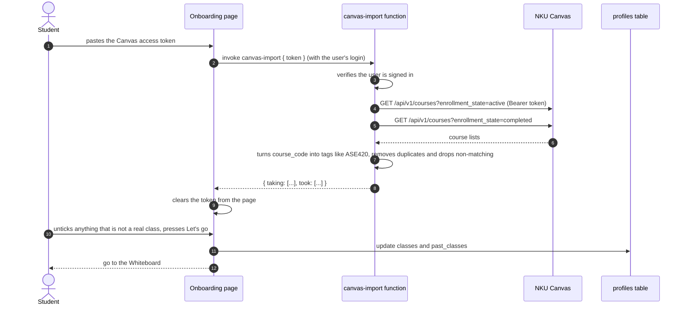
```mermaid
sequenceDiagram
  autonumber
  actor U as Student
  participant O as Onboarding page
  participant F as canvas-import function
  participant C as NKU Canvas
  participant P as profiles table

  U->>O: pastes the Canvas access token
  O->>F: invoke canvas-import { token } (with the user's login)
  F->>F: verifies the user is signed in
  F->>C: GET /api/v1/courses?enrollment_state=active (Bearer token)
  F->>C: GET /api/v1/courses?enrollment_state=completed
  C-->>F: course lists
  F->>F: turns course_code into tags like ASE420, removes duplicates and drops non-matching
  F-->>O: { taking: [...], took: [...] }
  O->>O: clears the token from the page
  U->>O: unticks anything that is not a real class, presses Let's go
  O->>P: update classes and past_classes
  O-->>U: go to the Whiteboard
```

If Canvas rejects the token, the function returns `bad_token` and the page shows "That token didn't work. Try making a new one", with a "Type them instead" fallback that normalises `ase 420` to `ASE420`.

### 5.3 Opening a board, autosave, switching boards

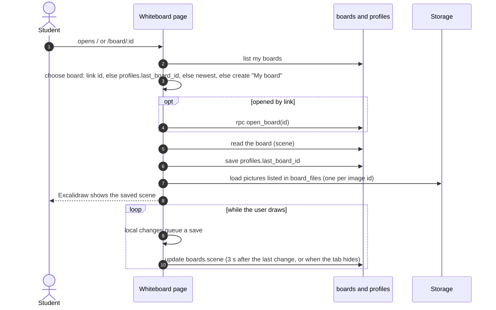
```mermaid
sequenceDiagram
  autonumber
  actor U as Student
  participant W as Whiteboard page
  participant DB as boards and profiles
  participant S as Storage

  U->>W: opens / or /board/:id
  W->>DB: list my boards
  W->>W: choose board: link id, else profiles.last_board_id, else newest, else create "My board"
  opt opened by link
    W->>DB: rpc open_board(id)
  end
  W->>DB: read the board (scene)
  W->>DB: save profiles.last_board_id
  W->>S: load pictures listed in board_files (one per image id)
  W-->>U: Excalidraw shows the saved scene
  loop while the user draws
    W->>W: local changes queue a save
    W->>DB: update boards.scene (3 s after the last change, or when the tab hides)
  end
```

### 5.4 Uploading an image or PDF

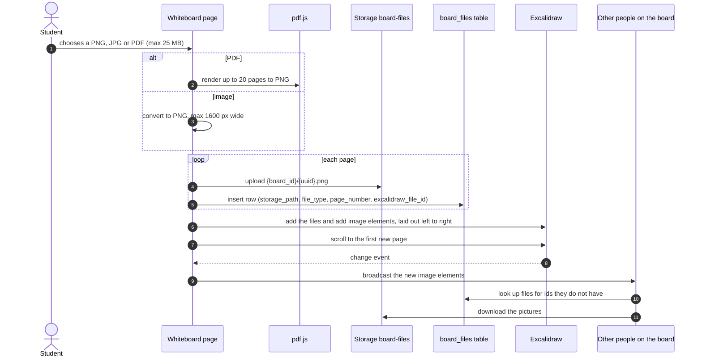
```mermaid
sequenceDiagram
  autonumber
  actor U as Student
  participant W as Whiteboard page
  participant PD as pdf.js
  participant S as Storage board-files
  participant DB as board_files table
  participant X as Excalidraw
  participant R as Other people on the board

  U->>W: chooses a PNG, JPG or PDF (max 25 MB)
  alt PDF
    W->>PD: render up to 20 pages to PNG
  else image
    W->>W: convert to PNG, max 1600 px wide
  end
  loop each page
    W->>S: upload {board_id}/{uuid}.png
    W->>DB: insert row (storage_path, file_type, page_number, excalidraw_file_id)
  end
  W->>X: add the files and add image elements, laid out left to right
  W->>X: scroll to the first new page
  X-->>W: change event
  W->>R: broadcast the new image elements
  R->>DB: look up files for ids they do not have
  R->>S: download the pictures
```

The page counter at the bottom right counts the picture elements actually on the board, left to right, and follows whichever one is nearest the middle of the screen. Deleting a picture lowers the count.

### 5.5 Live drawing sync

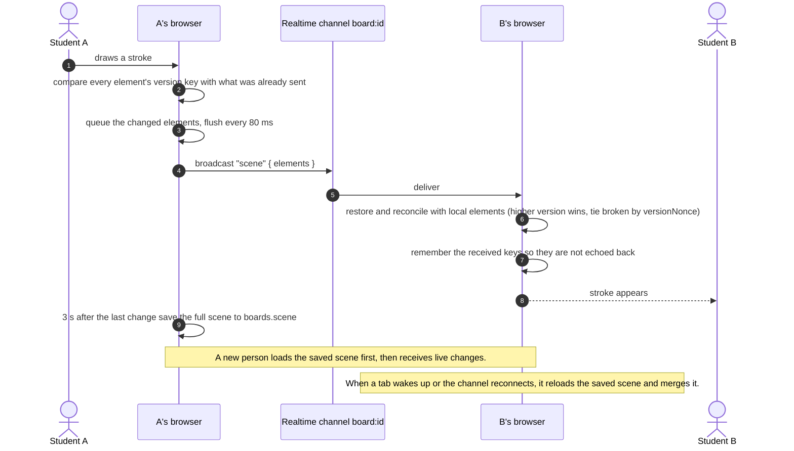
```mermaid
sequenceDiagram
  autonumber
  actor A as Student A
  participant WA as A's browser
  participant RT as Realtime channel board:id
  participant WB as B's browser
  actor B as Student B

  A->>WA: draws a stroke
  WA->>WA: compare every element's version key with what was already sent
  WA->>WA: queue the changed elements, flush every 80 ms
  WA->>RT: broadcast "scene" { elements }
  RT->>WB: deliver
  WB->>WB: restore and reconcile with local elements (higher version wins, tie broken by versionNonce)
  WB->>WB: remember the received keys so they are not echoed back
  WB-->>B: stroke appears
  WA->>WA: 3 s after the last change save the full scene to boards.scene
  Note over WA,WB: A new person loads the saved scene first, then receives live changes.
  Note over WB: When a tab wakes up or the channel reconnects, it reloads the saved scene and merges it.
```

Merging rules, in plain words: each shape has a version number. When two copies of the same shape meet, the one with the higher version wins. Shapes someone is in the middle of editing locally are kept. Deletions are shapes with a "deleted" flag, so they travel the same way.

### 5.6 Ask AI

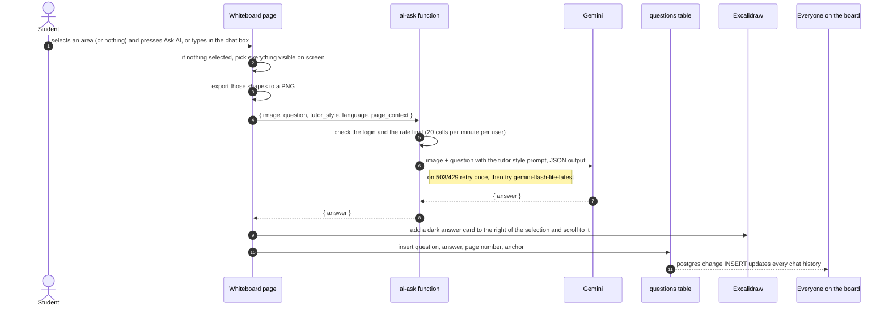
```mermaid
sequenceDiagram
  autonumber
  actor U as Student
  participant W as Whiteboard page
  participant F as ai-ask function
  participant G as Gemini
  participant Q as questions table
  participant X as Excalidraw
  participant R as Everyone on the board

  U->>W: selects an area (or nothing) and presses Ask AI, or types in the chat box
  W->>W: if nothing selected, pick everything visible on screen
  W->>W: export those shapes to a PNG
  W->>F: { image, question, tutor_style, language, page_context }
  F->>F: check the login and the rate limit (20 calls per minute per user)
  F->>G: image + question with the tutor style prompt, JSON output
  Note right of F: on 503/429 retry once, then try gemini-flash-lite-latest
  G-->>F: { answer }
  F-->>W: { answer }
  W->>X: add a dark answer card to the right of the selection and scroll to it
  W->>Q: insert question, answer, page number, anchor
  Q-->>R: postgres change INSERT updates every chat history
```

### 5.7 AI lesson, auto-pause and redirect

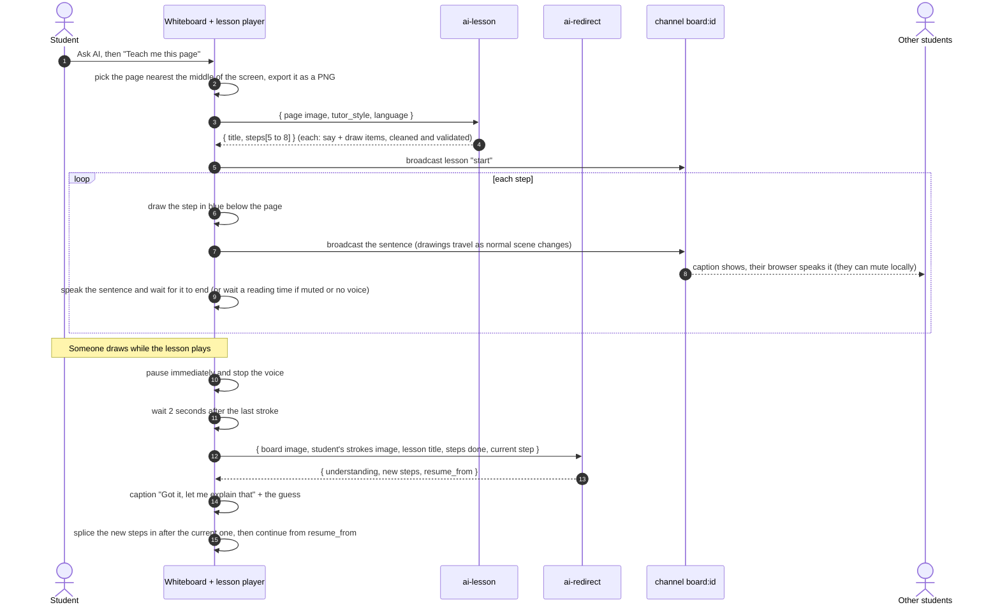
```mermaid
sequenceDiagram
  autonumber
  actor U as Student
  participant W as Whiteboard + lesson player
  participant F1 as ai-lesson
  participant F2 as ai-redirect
  participant RT as channel board:id
  actor O as Other students

  U->>W: Ask AI, then "Teach me this page"
  W->>W: pick the page nearest the middle of the screen, export it as a PNG
  W->>F1: { page image, tutor_style, language }
  F1-->>W: { title, steps[5 to 8] } (each: say + draw items, cleaned and validated)
  W->>RT: broadcast lesson "start"
  loop each step
    W->>W: draw the step in blue below the page
    W->>RT: broadcast the sentence (drawings travel as normal scene changes)
    RT-->>O: caption shows, their browser speaks it (they can mute locally)
    W->>W: speak the sentence and wait for it to end (or wait a reading time if muted or no voice)
  end
  Note over U,W: Someone draws while the lesson plays
  W->>W: pause immediately and stop the voice
  W->>W: wait 2 seconds after the last stroke
  W->>F2: { board image, student's strokes image, lesson title, steps done, current step }
  F2-->>W: { understanding, new steps, resume_from }
  W->>W: caption "Got it, let me explain that" + the guess
  W->>W: splice the new steps in after the current one, then continue from resume_from
```

### 5.8 Community: showing notes, creating, joining

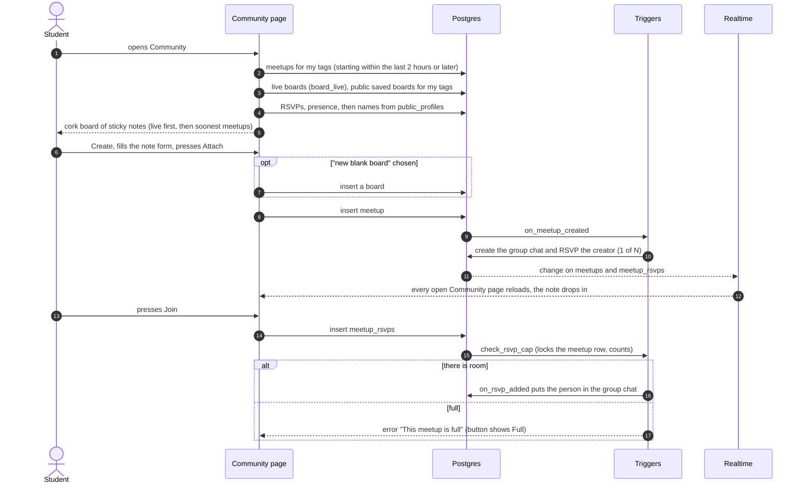
```mermaid
sequenceDiagram
  autonumber
  actor U as Student
  participant C as Community page
  participant DB as Postgres
  participant TR as Triggers
  participant RT as Realtime

  U->>C: opens Community
  C->>DB: meetups for my tags (starting within the last 2 hours or later)
  C->>DB: live boards (board_live), public saved boards for my tags
  C->>DB: RSVPs, presence, then names from public_profiles
  C-->>U: cork board of sticky notes (live first, then soonest meetups)

  U->>C: Create, fills the note form, presses Attach
  opt "new blank board" chosen
    C->>DB: insert a board
  end
  C->>DB: insert meetup
  DB->>TR: on_meetup_created
  TR->>DB: create the group chat and RSVP the creator (1 of N)
  DB-->>RT: change on meetups and meetup_rsvps
  RT-->>C: every open Community page reloads, the note drops in

  U->>C: presses Join
  C->>DB: insert meetup_rsvps
  DB->>TR: check_rsvp_cap (locks the meetup row, counts)
  alt there is room
    TR->>DB: on_rsvp_added puts the person in the group chat
  else full
    TR-->>C: error "This meetup is full" (button shows Full)
  end
```

Which notes you see: only notes tagged with a class in your Taking or Took lists. The "You took this, help out" label appears when the tag is in your Took list. Saved boards open read-only at `/saved/:id` with a "Copy to my boards" button that copies the scene and the picture files into a new board you own.

### 5.9 Messages

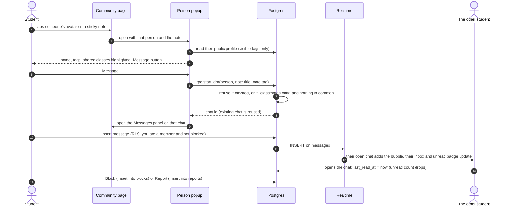
```mermaid
sequenceDiagram
  autonumber
  actor U as Student
  participant C as Community page
  participant PP as Person popup
  participant DB as Postgres
  participant RT as Realtime
  actor V as The other student

  U->>C: taps someone's avatar on a sticky note
  C->>PP: open with that person and the note
  PP->>DB: read their public profile (visible tags only)
  PP-->>U: name, tags, shared classes highlighted, Message button
  U->>PP: Message
  PP->>DB: rpc start_dm(person, note title, note tag)
  DB->>DB: refuse if blocked, or if "classmates only" and nothing in common
  DB-->>PP: chat id (existing chat is reused)
  PP->>C: open the Messages panel on that chat
  U->>DB: insert message (RLS: you are a member and not blocked)
  DB-->>RT: INSERT on messages
  RT-->>V: their open chat adds the bubble, their inbox and unread badge update
  V->>DB: opens the chat: last_read_at = now (unread count drops)
  U->>DB: Block (insert into blocks) or Report (insert into reports)
```

Bubble icon on Community: the number is the sum of unread messages across all chats. A chat row shows the person's name, the ⋮ menu (Block / Report), the sticky note you met through, the last message, the time and a blue dot if unread. Meetup group chats are listed too; their membership follows the RSVP triggers, and their header shows place, time and head count. "Share a board" sends a message with `board_id`, shown as a card with a Join button.

### 5.10 Profile and Settings

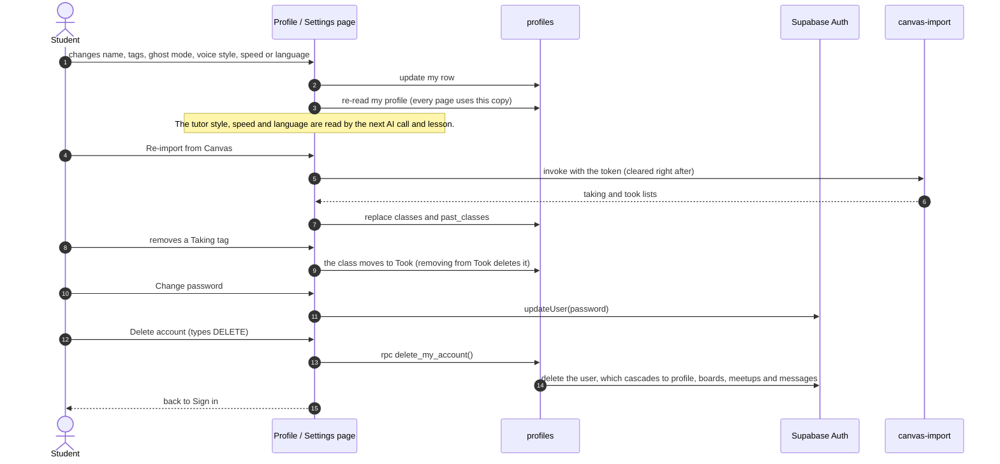
```mermaid
sequenceDiagram
  autonumber
  actor U as Student
  participant P as Profile / Settings page
  participant DB as profiles
  participant A as Supabase Auth
  participant F as canvas-import

  U->>P: changes name, tags, ghost mode, voice style, speed or language
  P->>DB: update my row
  P->>DB: re-read my profile (every page uses this copy)
  Note over P: The tutor style, speed and language are read by the next AI call and lesson.
  U->>P: Re-import from Canvas
  P->>F: invoke with the token (cleared right after)
  F-->>P: taking and took lists
  P->>DB: replace classes and past_classes
  U->>P: removes a Taking tag
  P->>DB: the class moves to Took (removing from Took deletes it)
  U->>P: Change password
  P->>A: updateUser(password)
  U->>P: Delete account (types DELETE)
  P->>DB: rpc delete_my_account()
  DB->>A: delete the user, which cascades to profile, boards, meetups and messages
  P-->>U: back to Sign in
```

---

## 6. Frontend structure

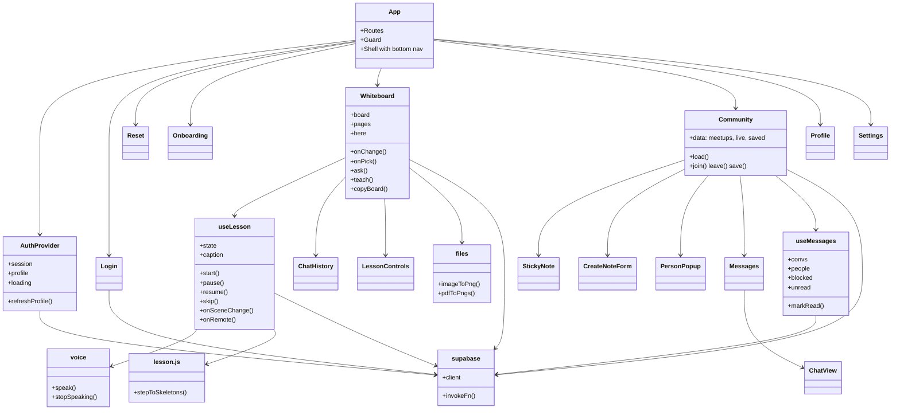
```mermaid
classDiagram
  class App {
    +Routes
    +Guard
    +Shell with bottom nav
  }
  class AuthProvider {
    +session
    +profile
    +loading
    +refreshProfile()
  }
  class Whiteboard {
    +board
    +pages
    +here
    +onChange()
    +onPick()
    +ask()
    +teach()
    +copyBoard()
  }
  class useLesson {
    +state
    +caption
    +start()
    +pause()
    +resume()
    +skip()
    +onSceneChange()
    +onRemote()
  }
  class Community {
    +data: meetups, live, saved
    +load()
    +join() leave() save()
  }
  class useMessages {
    +convs
    +people
    +blocked
    +unread
    +markRead()
  }
  class Messages
  class ChatView
  class PersonPopup
  class StickyNote
  class CreateNoteForm
  class ChatHistory
  class LessonControls
  class Login
  class Reset
  class Onboarding
  class Profile
  class Settings
  class supabase {
    +client
    +invokeFn()
  }
  class files {
    +imageToPng()
    +pdfToPngs()
  }
  class voice {
    +speak()
    +stopSpeaking()
  }
  class lessonDrawing["lesson.js"] {
    +stepToSkeletons()
  }

  App --> AuthProvider
  App --> Login
  App --> Reset
  App --> Onboarding
  App --> Whiteboard
  App --> Community
  App --> Profile
  App --> Settings
  Whiteboard --> useLesson
  Whiteboard --> ChatHistory
  Whiteboard --> LessonControls
  Whiteboard --> files
  useLesson --> voice
  useLesson --> lessonDrawing
  Community --> StickyNote
  Community --> CreateNoteForm
  Community --> PersonPopup
  Community --> Messages
  Community --> useMessages
  Messages --> ChatView
  Login --> supabase
  Whiteboard --> supabase
  Community --> supabase
  useMessages --> supabase
  useLesson --> supabase
  AuthProvider --> supabase
```

| File | Responsibility |
|---|---|
| `src/App.jsx` | routes, the route guard (signed out goes to Sign in; no classes goes to Onboarding), bottom navigation |
| `src/lib/auth.jsx` | `AuthProvider`: session, profile, refresh |
| `src/lib/supabase.js` | the client (PKCE) and `invokeFn`, which calls an Edge Function and returns the server's error reason |
| `src/lib/useLesson.js` | the whole lesson player and the auto-pause logic |
| `src/lib/lesson.js` | converts one AI step into Excalidraw shapes (arrows land on the edges of earlier shapes) |
| `src/lib/voice.js` | speech with rate and pitch per tutor style; text only if no voice exists |
| `src/lib/files.js` | image and PDF to PNG, data URLs |
| `src/lib/useMessages.js` | chats, people, unread counts, Realtime reload |
| `src/lib/tags.js` | `normalizeTag` (ase 420 becomes ASE420) and `sortTags` (alphabetical) |
| `src/pages/*` | one file per screen |
| `src/components/*` | StickyNote, CreateNoteForm, Messages, ChatView, PersonPopup, ChatHistory, LessonControls |
| `supabase/migrations/*.sql` | the schema, RLS, triggers, Realtime, in order 0001 to 0004 |
| `supabase/functions/*` | `canvas-import`, `ai-ask`, `ai-lesson`, `ai-redirect`, and `_shared/ai.ts` |

---

## 7. State machines

### 7.1 Route guard

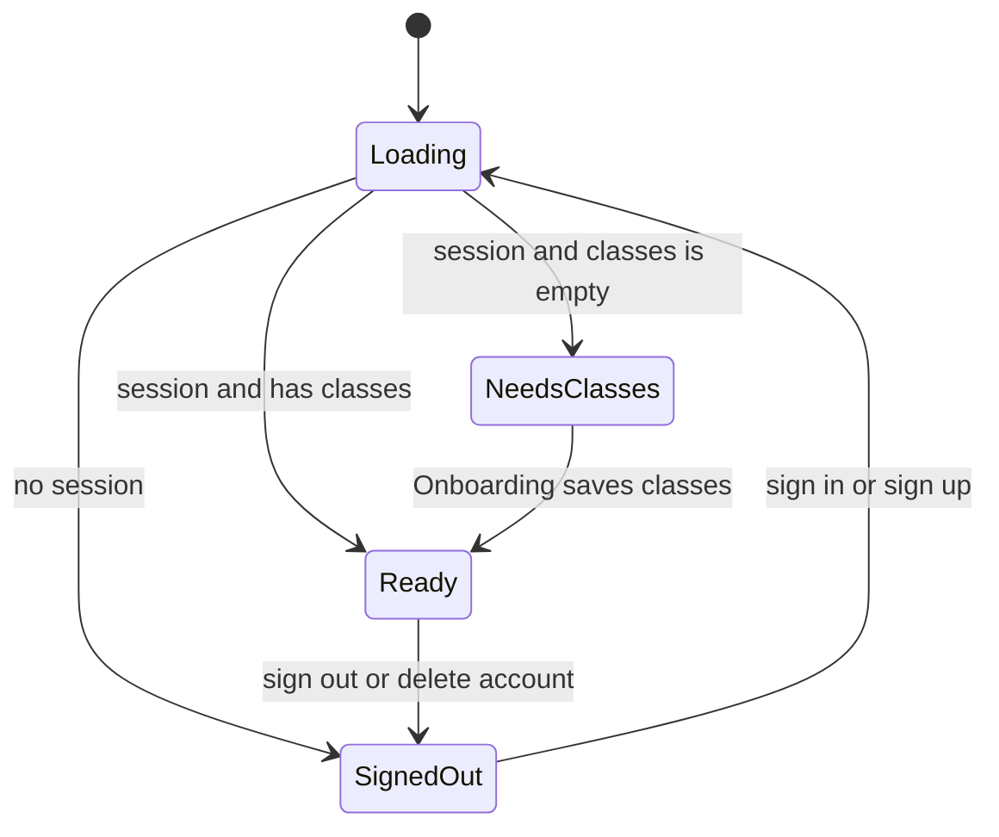
```mermaid
stateDiagram-v2
  [*] --> Loading
  Loading --> SignedOut: no session
  Loading --> NeedsClasses: session and classes is empty
  Loading --> Ready: session and has classes
  SignedOut --> Loading: sign in or sign up
  NeedsClasses --> Ready: Onboarding saves classes
  Ready --> SignedOut: sign out or delete account
```

### 7.2 AI lesson player

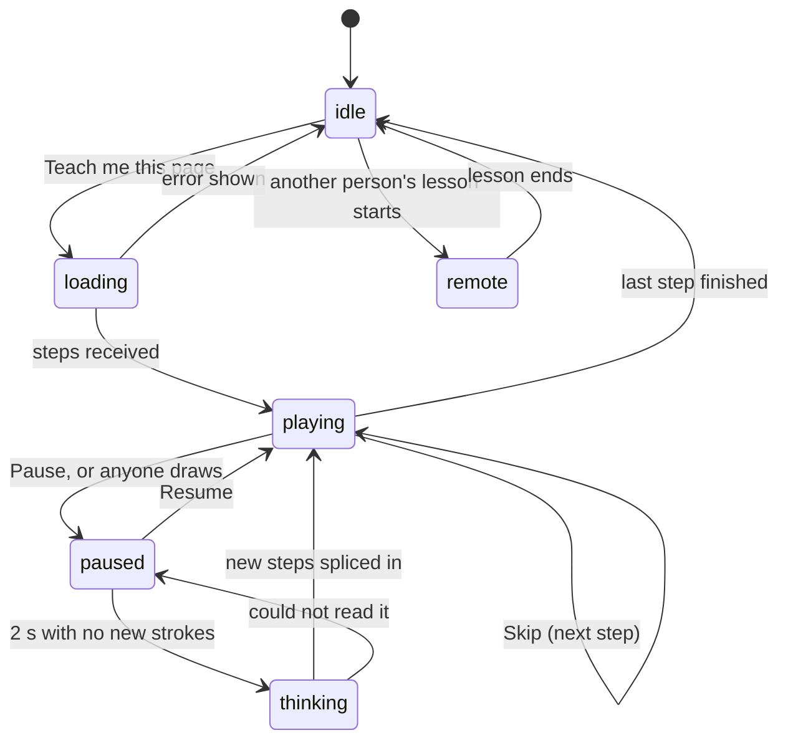
```mermaid
stateDiagram-v2
  [*] --> idle
  idle --> loading: Teach me this page
  loading --> playing: steps received
  loading --> idle: error shown
  playing --> paused: Pause, or anyone draws
  paused --> playing: Resume
  paused --> thinking: 2 s with no new strokes
  thinking --> playing: new steps spliced in
  thinking --> paused: could not read it
  playing --> playing: Skip (next step)
  playing --> idle: last step finished
  idle --> remote: another person's lesson starts
  remote --> idle: lesson ends
```

### 7.3 Joining a meetup note

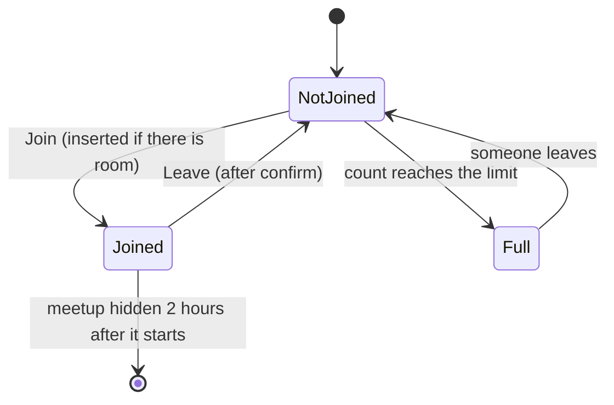
```mermaid
stateDiagram-v2
  [*] --> NotJoined
  NotJoined --> Joined: Join (inserted if there is room)
  NotJoined --> Full: count reaches the limit
  Full --> NotJoined: someone leaves
  Joined --> NotJoined: Leave (after confirm)
  Joined --> [*]: meetup hidden 2 hours after it starts
```

### 7.4 A chat between two people

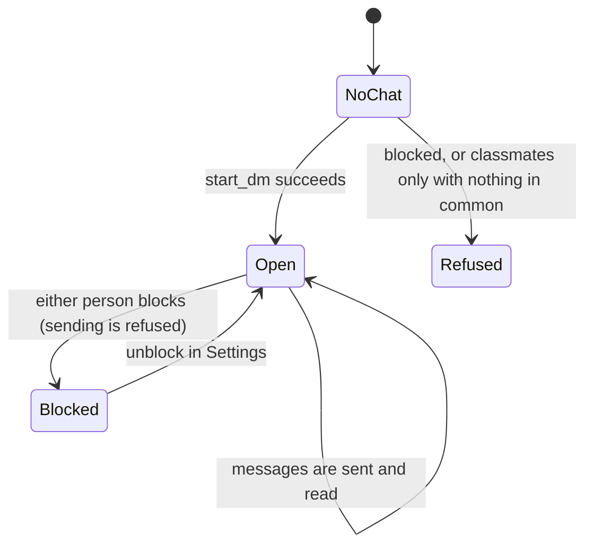
```mermaid
stateDiagram-v2
  [*] --> NoChat
  NoChat --> Open: start_dm succeeds
  NoChat --> Refused: blocked, or classmates only with nothing in common
  Open --> Open: messages are sent and read
  Open --> Blocked: either person blocks (sending is refused)
  Blocked --> Open: unblock in Settings
```

### 7.5 A message's read state

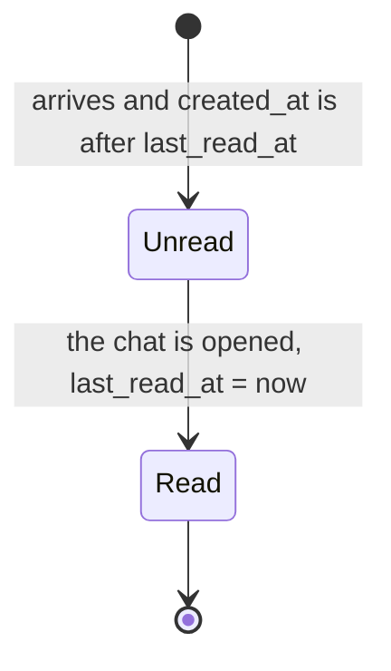
```mermaid
stateDiagram-v2
  [*] --> Unread: arrives and created_at is after last_read_at
  Unread --> Read: the chat is opened, last_read_at = now
  Read --> [*]
```

---

## 8. Security model

- **Authentication**: Supabase Auth, email and password. The `@nku.edu` rule is enforced by a database trigger.
- **Authorisation**: every table has RLS. The client never decides permissions. Functions that need extra power (`start_dm`, `open_board`, `delete_my_account`, the cap trigger) are `security definer`, set an empty `search_path`, and are only executable by signed-in users.
- **Privacy**: other people never see your `email`, `full_name` or hidden tags. They read `public_profiles`.
- **Secrets**: only in Edge Function secrets (`GEMINI_API_KEY`, `CANVAS_BASE_URL`). The browser's `.env` has only the public URL and anon key and is never committed.
- **Edge Functions** verify the caller's login themselves and rate-limit AI calls to 20 per minute per user. This limit is held in memory per function instance, so it is best-effort.
- **Input checks**: image sizes are capped, message length is 1 to 2000, meetup size is 2 to 10, AI output is validated and cleaned before it can reach the board.

---

## 9. Edge Function contracts

| Function | Input | Output | Notes |
|---|---|---|---|
| `canvas-import` | `{ token }` | `{ taking: [], took: [] }` or `{ error: "bad_token" }` | tags come from `course_code` by the pattern two to four letters then three digits |
| `ai-ask` | `{ image_base64, question, tutor_style, language, page_context }` | `{ answer }` (about 120 words) | |
| `ai-lesson` | `{ page_image_base64, tutor_style, language }` | `{ title, steps: [{ say, draw: [...] }] }` | 3 to 8 steps; draw types: text, rect, ellipse, arrow, highlight |
| `ai-redirect` | `{ board_image_base64, student_strokes_image_base64, lesson_title, steps_done, current_step_index, tutor_style, language }` | `{ understanding, steps, resume_from }` | `resume_from` is a step index or null |

All four need a signed-in caller. The AI functions call Gemini in JSON mode with a schema, retry once on "high demand", then fall back to a lighter model.

---

## 10. Running, deploying and changing it

**Run it on your computer**

1. In the project folder run `npm install` once, then `npm run dev`.
2. Open `http://localhost:5173/norse-whiteboard/`.
3. `.env` must contain `VITE_SUPABASE_URL` and `VITE_SUPABASE_ANON_KEY`.

**Change the database**: add a new numbered file in `supabase/migrations/`, then run `npx supabase db query --linked -f supabase/migrations/NNNN_name.sql`.

**Change an Edge Function**: edit it under `supabase/functions/`, then run `npx supabase functions deploy NAME --no-verify-jwt --use-api` (the functions check the login themselves).

**Set a secret**: `npx supabase secrets set NAME=value` (run it in your own terminal; do not paste secrets into chat).

**Publish the website**

1. Push the code to the GitHub repo.
2. In the repo, Settings, Pages: Source is "GitHub Actions".
3. In Settings, Secrets and variables, Actions: add `VITE_SUPABASE_URL` and `VITE_SUPABASE_ANON_KEY`.
4. The workflow `.github/workflows/deploy.yml` builds and publishes on every push to `main`.
5. In Supabase, Authentication, URL Configuration: the site address must be in the redirect list so password-reset links come back to it.

**Known limits**: no live cursors; the lesson's voice needs a browser that has speech voices (otherwise text only); the AI rate limit is per function instance; uploaded images stay in Storage after an account is deleted.

---

## 11. Credentials, tokens and personal information

This section says exactly where every secret and every piece of personal information is kept, who can read it, and how it travels.

### 11.1 The five kinds of secret, at a glance

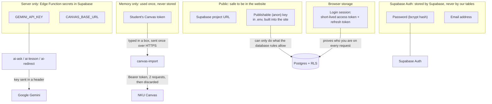
```mermaid
flowchart TB
  subgraph Public["Public: safe to be in the website"]
    URL["Supabase project URL"]
    ANON["Publishable (anon) key<br/>in .env, built into the site"]
  end

  subgraph Server["Server only: Edge Function secrets in Supabase"]
    GEM["GEMINI_API_KEY"]
    CAN["CANVAS_BASE_URL"]
  end

  subgraph Memory["Memory only: used once, never stored"]
    TOK["Student's Canvas token"]
  end

  subgraph Auth["Supabase Auth: stored by Supabase, never by our tables"]
    PWD["Password (bcrypt hash)"]
    EML["Email address"]
  end

  subgraph Browser["Browser storage"]
    SES["Login session:<br/>short-lived access token + refresh token"]
  end

  TOK -- "typed in a box, sent once over HTTPS" --> F1["canvas-import"]
  F1 -- "Bearer token, 2 requests, then discarded" --> C["NKU Canvas"]
  GEM --- F2["ai-ask / ai-lesson / ai-redirect"]
  F2 -- "key sent in a header" --> G["Google Gemini"]
  ANON -- "can only do what the database rules allow" --> DB[("Postgres + RLS")]
  PWD --- A["Supabase Auth"]
  SES -- "proves who you are on every request" --> DB
```

### 11.2 Exactly where each one is stored

| Secret or information | Where it is stored | Where it is NOT stored | Who can read it |
|---|---|---|---|
| **Gemini API key** | Supabase, as the Edge Function secret `GEMINI_API_KEY` (set with `npx supabase secrets set`) | not in the website code, not in `.env`, not in GitHub, not in the database | only the Edge Functions while they run, and the Supabase project owner |
| **Canvas address** (`https://nku.instructure.com`) | Edge Function secret `CANVAS_BASE_URL` | not in the website code | the `canvas-import` function |
| **Student's Canvas token** | nowhere. It is typed into a box, kept in the page's memory for seconds, sent to `canvas-import`, used for two Canvas requests and thrown away. The page clears the box right after the request. | not in the database, not in browser storage, not in logs | nobody, because it is never kept |
| **Supabase publishable (anon) key and URL** | `.env` on your computer (git-ignored) and, for the live site, the two GitHub Actions secrets `VITE_SUPABASE_URL` and `VITE_SUPABASE_ANON_KEY`, which get built into the site | the `service_role` or secret key is never used anywhere in this project | everyone (it is public by design; safe because of Row Level Security) |
| **Password** | Supabase Auth, as a **bcrypt hash** inside Supabase's private `auth` schema | never in our tables, never readable by our code, never sent anywhere except to Supabase Auth over HTTPS when you sign in or change it | nobody can read the original; only Supabase Auth can check it |
| **Email address** | `auth.users` (Supabase Auth) and a copy in `profiles.email` | not shown to other students | you (your own profile row) and Supabase Auth. Other students read only the `public_profiles` view, which has no email |
| **Account name** (`full_name`) | sign-up data in `auth.users` and `profiles.full_name` | not shown to other students | only you |
| **Display name** | `profiles.display_name` | | every signed-in student (this is the public name) |
| **Classes** (Taking, Took) and hidden tags | `profiles.classes`, `past_classes`, `hidden_tags` | | you see all of them; others see only tags you have not hidden (the `public_profiles` view filters them) |
| **Login session** | the browser's own storage, written by supabase-js: an access token that lasts about an hour and a refresh token that renews it | not in our tables; our own code writes nothing else to browser storage | that browser only; removed on sign out |
| **Messages** | `messages` table | | only members of that conversation |
| **Boards, pictures, questions** | `boards`, Storage `board-files`, `questions` | | anyone who can read the board (public = any signed-in student) |

### 11.3 The login: what happens to your email and password

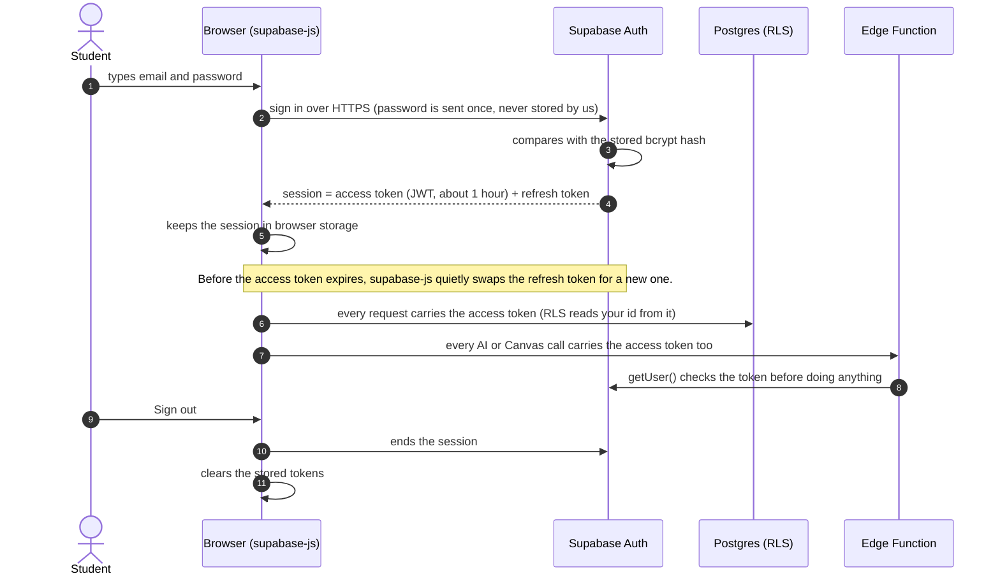
```mermaid
sequenceDiagram
  autonumber
  actor U as Student
  participant B as Browser (supabase-js)
  participant A as Supabase Auth
  participant DB as Postgres (RLS)
  participant F as Edge Function

  U->>B: types email and password
  B->>A: sign in over HTTPS (password is sent once, never stored by us)
  A->>A: compares with the stored bcrypt hash
  A-->>B: session = access token (JWT, about 1 hour) + refresh token
  B->>B: keeps the session in browser storage
  Note over B,A: Before the access token expires, supabase-js quietly swaps the refresh token for a new one.
  B->>DB: every request carries the access token (RLS reads your id from it)
  B->>F: every AI or Canvas call carries the access token too
  F->>A: getUser() checks the token before doing anything
  U->>B: Sign out
  B->>A: ends the session
  B->>B: clears the stored tokens
```

Facts worth knowing:

- **The password is never in our database.** Our `profiles` table has no password column. Supabase Auth keeps only a bcrypt hash, so even the project owner cannot read anybody's password.
- **The access token contains your user id** and is what makes Row Level Security work: the database reads "who is asking" from it, and the browser cannot lie about it.
- **Reset password:** the email link carries a one-time `?code=...` (PKCE). The link is valid for the "Email OTP expiration" set in Supabase (3600 seconds, one hour). After using it, you type a new password, and Auth stores a new hash.
- **Password rules:** the form requires at least 8 characters. Supabase has its own minimum in the dashboard (Authentication, Sign In / Providers, Email, "Minimum password length"); the default is 6, so set it to 8 if you want the server to enforce the same rule as the form.
- **Email confirmation is OFF right now** (the spec says to leave it off for now). That means the `@nku.edu` rule only checks the text of the address. Someone could sign up with an `@nku.edu` address they do not actually own. Turning confirmation on later closes that gap (and needs an email sender set up, because the free built-in sender is very limited).
- **Deleting your account** (Settings) removes your `auth.users` row, which cascades to your profile, boards, meetups, messages and blocks.

### 11.4 The Canvas token, step by step

1. In Canvas, the student creates an access token (Account, Settings, New Access Token).
2. They paste it into the Onboarding box (or the Settings "Re-import" box). It lives in that box's memory only.
3. The browser calls `canvas-import` with the token in the request body and the student's login in the header.
4. The function checks the login, reads `CANVAS_BASE_URL` from its secrets, and sends the token to Canvas as `Authorization: Bearer ...` for exactly two requests (current courses, completed courses).
5. It returns only the class codes (like `ASE420`). The token is not written to the database, not written to any log, and not returned.
6. The page clears the box. The student can delete the token in Canvas at any time.

What is stored afterwards: only the class tags, in `profiles.classes` and `past_classes`.

### 11.5 The Gemini key, step by step

1. The key is created in Google AI Studio and saved once with `npx supabase secrets set GEMINI_API_KEY=...` from your own terminal.
2. Only the three AI Edge Functions read it, from the server's environment, at the moment they call Gemini. It is sent in a request header to Google.
3. The browser never receives it. If it was ever shown in a chat or a screenshot, make a new key in AI Studio, delete the old one, and run the command again.
4. The functions log only short error reasons (for example "gemini 503") and never the images, questions or answers.

### 11.6 Protection in transit and at rest

- Everything the browser sends goes over HTTPS, and Realtime uses a secure WebSocket.
- Supabase encrypts its database and storage at rest.
- Messages are protected by access rules, not end-to-end encryption. They are visible to people who administer the database.
- Reports are stored in `reports` and nobody can read them through the app (it is insert-only), so they are reviewed from the Supabase dashboard.

---

## 12. What is live, what is not, and how syncing works

### 12.1 The short version

| Live (updates for other people without a refresh) | Not live (updates on the next load or action) |
|---|---|
| Drawing, erasing, shapes and text on a board | Your profile changes (display name, tags, voice) as seen by other people |
| Uploaded pictures and PDF pages appearing on other screens | The saved boards list in Community |
| AI lesson captions, spoken sentences, pause, and the diagrams it draws | Who has blocked you |
| New AI questions and answers in the chat history | Settings, passwords and Canvas imports |
| Sticky notes appearing, changing and disappearing in Community | The board list in the title menu |
| Joins, leaves, counts, avatars and the Full state on a note | Class tag filters (they use your own saved tags) |
| New messages, the unread dot and the bubble count | |
| Meetup group chat membership (it follows joins and leaves) | |
| Online / Ghost / Offline pill | |
| "Live · N here" and avatars (**near-live**: refreshed every 20 seconds, so up to 20 seconds late) | |
| "N studying now" on live board notes (**near-live**: every 20 seconds) | |

### 12.2 The three layers of syncing a board

```mermaid
flowchart LR
  A["1. Broadcast<br/>fast path<br/>about 80 ms batches<br/>nothing stored"] --> B["2. Autosave<br/>the saved copy<br/>3 s after the last change<br/>boards.scene"]
  B --> C["3. Catch-up<br/>safety net<br/>reload and merge when you<br/>join, reconnect or return to the tab"]
```

1. **Broadcast (fast path).** The moment you change something, the app sends only the changed shapes to everyone else on the board's channel. They merge them straight into their canvas. Nothing is saved by this step.
2. **Autosave (the saved copy).** Three seconds after the last change, the person who made the change saves the whole scene to `boards.scene`. Only the person who changed things saves, so people watching do not rewrite the board.
3. **Catch-up (safety net).** When you open a board, you load the saved copy first. If a tab went to sleep, or the connection dropped and came back, the app reloads the saved copy and merges it into what you have, so you never stay behind.

### 12.3 How conflicts are settled

- Every shape has a **version number** that goes up on each change, and a random tie-breaker.
- When two copies of the same shape meet, the **higher version wins**. If versions are equal, the tie-breaker decides, so every browser makes the same choice.
- Shapes you are in the middle of editing are not overwritten.
- Deleting a shape just marks it deleted (and that mark travels like any change), so it disappears for everyone.
- Changes that arrive from other people are **not added to your Undo history**, so Undo only undoes your own work.
- Changes you receive are remembered so they are never sent back out (no echo loop).

### 12.4 What happens in the awkward cases

| Situation | What happens |
|---|---|
| You refresh the page | the saved scene is loaded, pictures are downloaded again, nothing is lost beyond the last 3 seconds if the tab was closed instantly (the app also saves when the tab hides) |
| Two people draw at once | both sets of strokes appear on both screens |
| Someone joins in the middle of a session | they load the saved copy, then receive live changes |
| Your internet drops | you can keep drawing; when it returns, the app reloads the saved copy and merges, and your unsent changes are sent because they differ from what was last sent |
| Someone uploads a PDF | the image elements broadcast immediately; other browsers fetch the pictures from Storage, retrying for a few seconds if the file record is still being saved |
| Two people click Join on the last spot | the database locks the meetup row; one gets in, the other sees "That meetup just filled up" |
| Someone blocks you | your sending is refused by the database; you simply cannot message them |
| The AI is busy ("high demand") | the function retries once, then tries a lighter model, then shows the reason |

### 12.5 Timing reference

| Thing | Interval |
|---|---|
| Broadcast batches while drawing | every 80 ms |
| Autosave of the scene | 3 s after the last change |
| Presence heartbeat ("I am here") | every 20 s; counts as present if seen in the last 60 s |
| Re-reading who is here and live boards | every 20 s |
| Login access token | about 1 hour, renewed automatically |
| Password reset link | valid for 1 hour |
| AI rate limit | 20 calls per minute per user |
