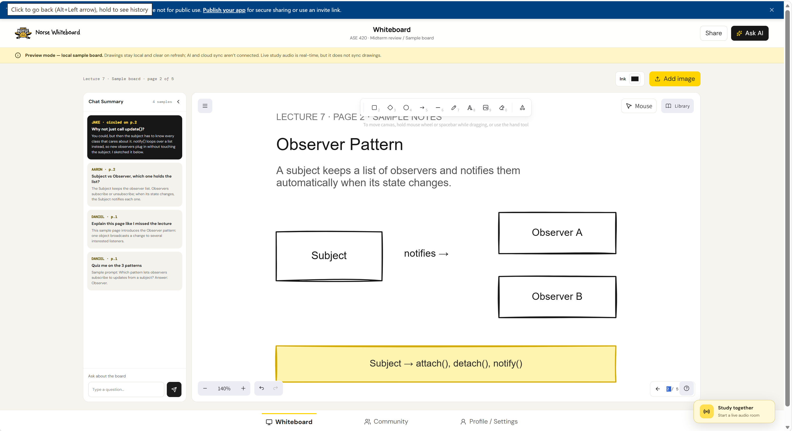
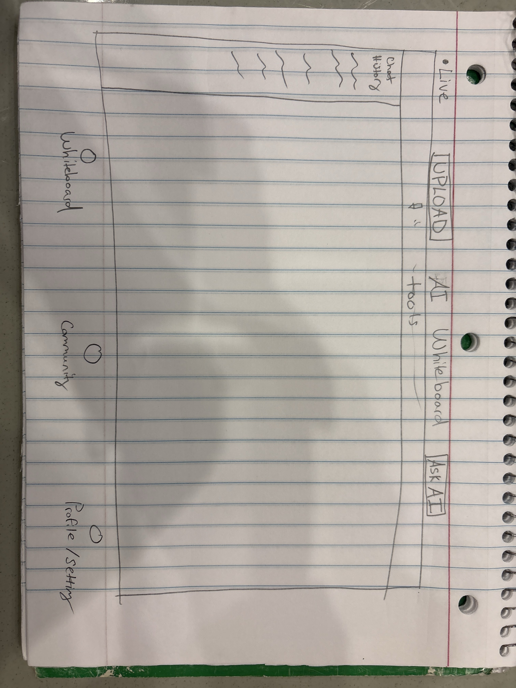
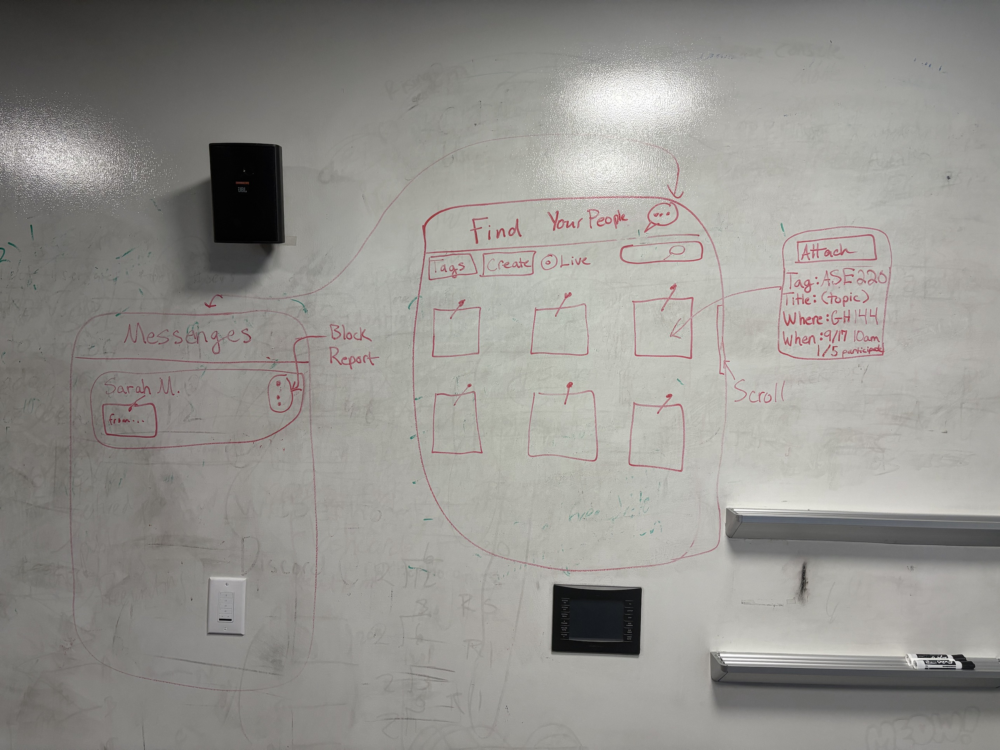
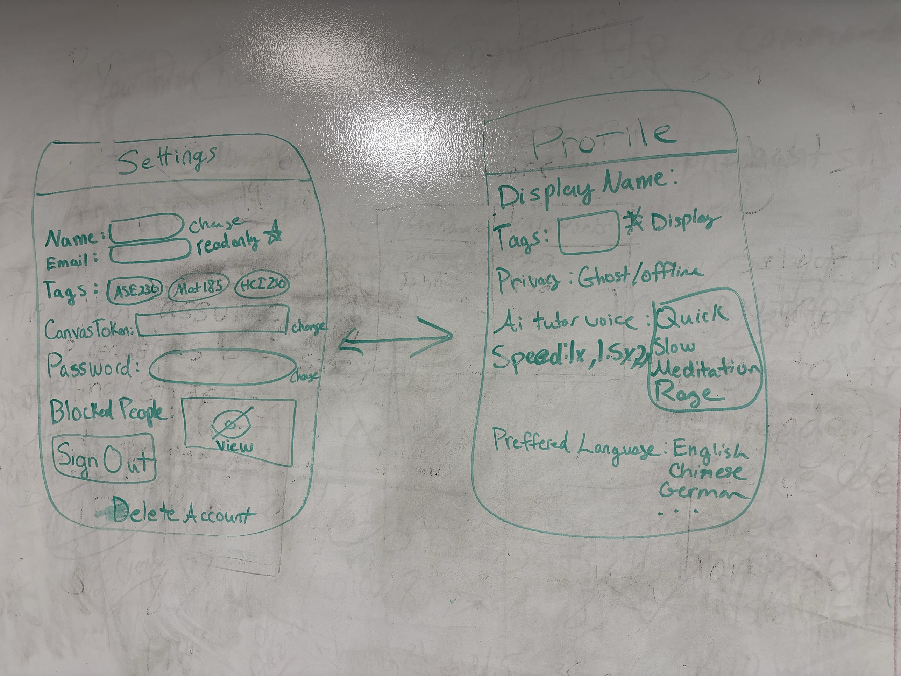

# Norse Whiteboard

An AI study whiteboard for NKU students. Upload notes, slides or PDFs, draw on them together, and ask the AI tutor about anything you circle. Find classmates through sticky notes on a community cork board, meet up, and message each other.

**Live site:** https://danthand005.github.io/Hackathon-Norse-Whiteboard/#/login

## What it does

- **Whiteboard:** Excalidraw canvas with uploads (images and PDFs), live drawing with other people, Ask AI on a selection, and "Teach me this page" lessons that draw and speak.
- **Community:** a cork board of sticky notes (meetups, live boards, saved boards) filtered by your classes. Create, join and leave, with live counts.
- **Messages:** one-on-one chats and meetup group chats, with Block and Report.
- **Profile and Settings:** display name, which tags others can see, ghost mode, tutor voice, Canvas re-import, password, blocked people.

## Documentation

- [Architecture, data flow and live updates (with UML diagrams)](docs/ARCHITECTURE.md)
- [Build spec](CLAUDE.md)

## Run it on your computer

1. Install Node.js, then run `npm install` in this folder.
2. Copy `.env.example` to `.env` and fill in the two values (ask a teammate for the public key):
   ```
   VITE_SUPABASE_URL=https://hiuzbgdqurtatffvsdui.supabase.co
   VITE_SUPABASE_ANON_KEY=<publishable key>
   ```
3. Run `npm run dev` and open http://localhost:5173/norse-whiteboard/#/login

## Project layout

```
src/
  pages/        Login, Reset, Onboarding, Whiteboard, Community, Profile, Settings
  components/   StickyNote, CreateNoteForm, Messages, ChatView, PersonPopup, ChatHistory, LessonControls
  lib/          supabase client, auth, useLesson, useMessages, voice, files, tags
supabase/
  migrations/   database schema, rules, triggers (run in order)
  functions/    Edge Functions: canvas-import, ai-ask, ai-lesson, ai-redirect
docs/
  ARCHITECTURE.md   how everything fits together
  images/           mockups and sketches
.github/workflows/  deploy to GitHub Pages
```

## Stack

React + Vite, Excalidraw, pdf.js, Supabase (Postgres, Auth, Storage, Realtime, Edge Functions), Google Gemini, Web Speech API, GitHub Pages.

## Mockups




## Original sketches






